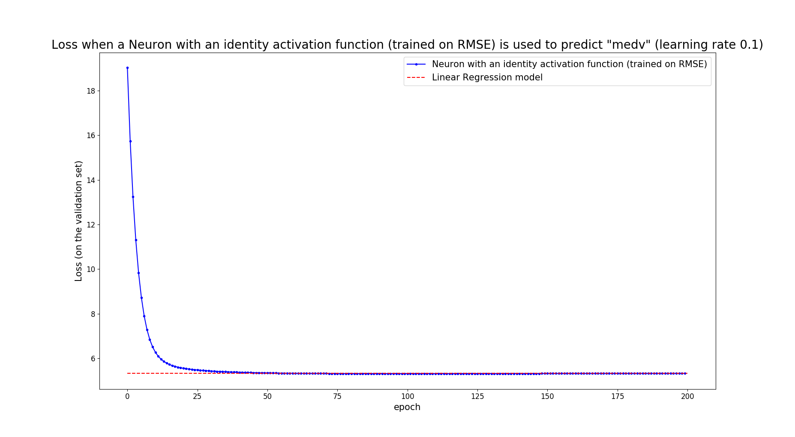
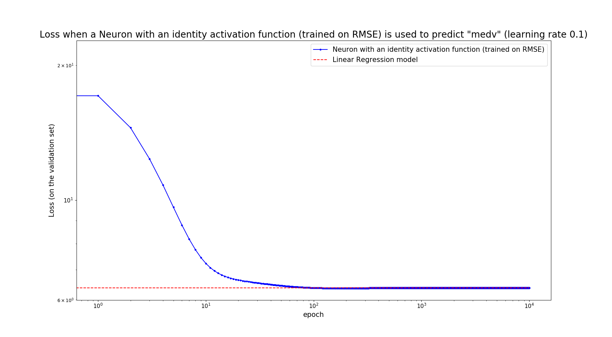
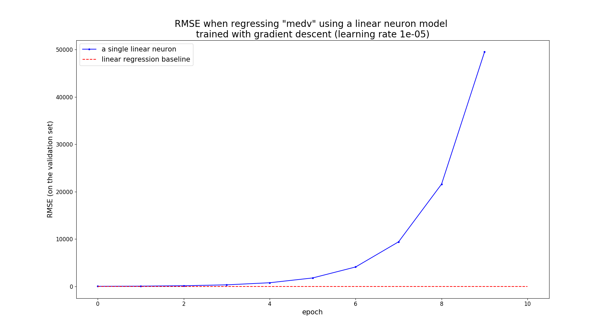
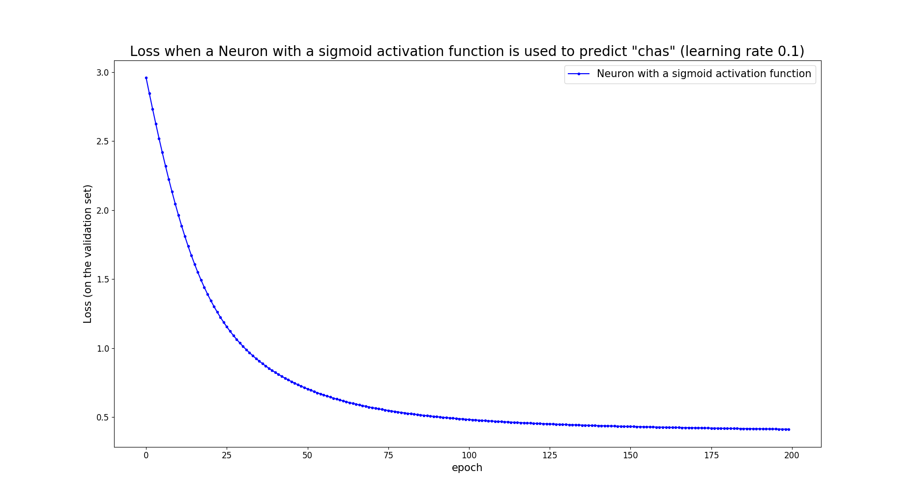

# Synopsis
`neuron.py`: Batch gradient descent on a model of a single artificial neuron and plotting of the progression of the loss on some validation set during the gradient descent iterations. The following activation functions are supported: The identity (which results in a linear model), the ReLU and the sigmoid. 

The only external dependancy for the core functionality of `neuron.py` is numpy. scikit-learn is used only during unit testing in order to verify that the implementation of scikit-learn agree with ours on the results.

# Requirements
* Python
* Matplotlib
* scikit-learn

# Syntax
```
neuron.py [-h] --csv FILENAME [--target-name NAME]
                 [--validation-set-ratio RATIO] [--epochs EPOCHS]
                 [--lrate LRATE] [--no-norm] [--lr-baseline] [--loglog]
```

**Important note**
This python package uses absolute import statements. That means that if the `single-neuron` package has not been installed to some standard place that Python normally looks to resolve import statement, then you should explicitly specify the top-level folder of the package. The easiest way to do so is via the PYTHONPATH environmental variable. For example, if you are already the top-level folder you can run the `neuron.py` as in the following example:

```console
user@system:~$ PYTHONPATH=$PWD single_neuron/neuron.py -h
```
# Description

The values of the parameters of the neuron model are estimated using batch gradient descent on some loss function. For the identity and the ReLU activation function, the loss is the RMSE (Root Mean Square Error) between the predicted values and the actual ones of the target variable. For the sigmoid activation function (which is intended to be used for binary classification tasks), the cross-entropy is employed as the loss function. Both of these are pretty standard choices and they can be justified by a maximum-likehood analysis of a regression task using a linear model and of a classification task using logistic regression.

`neuron.py` compuses the loss on a validation set at the end of every iteration of the gradient descent and it finally generates a plot in order to visualize the progression of these measurements.  Optionally, the performance achieved with the scikit-learn implementation of linear regression can be used for comparison, which is is displayed as a dotted horizontal line on the same plot.

## Command line arguments

There is just one required argument (the `--csv`) and the rest are optional. In particular:

* -h, --help
Show a detailed help message and exit.
* --csv FILENAME
**Required**. Relative path to the CSV file with the dataset. The syntax of this file is as follows: 
    * It should contain only ASCII character (probably Unicode works too, but it has not been covered by testing yet).
    * Every line ends with a newline character ('\n').
    * Values in the same row and in subsequent columns are separated by a comma (',').
    * Whitespace characters (tab, space) in the beginning and the end of the lines are ignored.
    * If the first non-whitespace character is a '#', the entire line is ignored (commented-out lines).
    * Empty lines or lines consisting of only whitespace are ignored.
    * The first line that is not empty and it has not commented it out should have the human-readable names of the columns
* --target-name NAME
The name of the target variable. If it is not specified then the last column of the supplied CSV file is used as such.
* --validation-set-ratio RATIO
The fraction of the dataset to be used for validation.
* --activation { sigm, identity, relu } 
Which activation function to use for the neuron model. For the identity activation function and for ReLU, the loss function that is used is the RMSE. For the sigmoid, it is the cross-entropy. **Note**: If you specify the sigmoid activation function then `neuron.py` will treat the target variable as a binary one. In particular, values of the target value which are above zero as considered as belonging to one class -- i.e. they get the label "1"-- and the rest as belonging the the complementary class -- i.e. they get the label "0". (default: identity).
* --epochs EPOCHS
Number of epochs (iterations) to use for gradient descent (default: 200).
* --lrate LRATE
Learning rate to use for gradient descent (default: 0.1).
* --no-norm
By default, each of the features is linearly rescaled to so that its value in the training set has a zero mean and a standard deviation of one. This switch prevents this default behavior (default: False).
* --lr-baseline
Optionally, you can specify that you want the performance of the trained model to be compared with the one achieved with linear regression. This will be shown as a horizontal line in the generated plot.  (default: False).
*  --loglog
Use a logarithmic scale for the two axes of the plot. This can be useful if you have specified many epochs (default: False).

# Examples

## Invocation with the default values 

As noted in [Command line arguments](#command-line-arguments) by default `neuron.py` performs 200 iterations of gradient descent with a learning rate of 0.1 using the 10% of the dataset for validation. For the example dataset that comes with the distribution ("dataset/boston.csv"), the results look like this:
```console
user@system:~$ PYTHONPATH=$PWD single_neuron/neuron.py --csv datasets/boston.csv --lr-baseline

Size of training set: 455
Size of validation set: 51
Dimensionality of feature space: 13

Training... ok. CPU elapsed time: 0.014 s

The loss with Neuron with an identity activation function (trained on RMSE) is: 5.32950596176643
The parameteres of Neuron with an identity activation function (trained on RMSE) are: 
[22.3512 -0.42    0.8487  0.4362  0.7    -1.78    2.6725  0.0444 -2.6572
  2.6671 -2.2879 -2.0309  0.9817 -4.1463]
The RMSE loss with a Linear Regression model is: 5.339050992809469
The parameteres of the Linear Regression model are: 
[22.3512 -0.4382  0.8584  0.4698  0.6953 -1.7861  2.6654  0.0531 -2.654
  2.7589 -2.3772 -2.0368  0.9828 -4.1529]

```

Notice how the values for the bias and the weights of the neuron are very close to those of the linear regression model. The generated plot is shown below:



## Increasing the number of epochs

Instead of 200 epochs, let' s specify 10000: 
```console
user@system:~$ PYTHONPATH=$PWD single_neuron/neuron.py --csv datasets/boston.csv --lr-baseline --epochs 10000 --loglog

Size of training set: 455
Size of validation set: 51
Dimensionality of feature space: 13

Training... ok. CPU elapsed time: 0.178 s

The loss with Neuron with an identity activation function (trained on RMSE) is: 6.371574886759834
The parameteres of Neuron with an identity activation function (trained on RMSE) are: 
[22.6136 -0.4777  0.951   0.3205  0.8137 -1.4109  2.8515 -0.153  -2.6869
  2.3618 -2.0646 -1.7574  1.1521 -3.8975]
The RMSE loss with a Linear Regression model is: 6.371574886759832
The parameteres of the Linear Regression model are: 
[22.6136 -0.4777  0.951   0.3205  0.8137 -1.4109  2.8515 -0.153  -2.6869
  2.3618 -2.0646 -1.7574  1.1521 -3.8975]

````

Within the displayed accuracy, the parameters of the neuron are equal to those learnt with linear regression. We have also specified the `--loglog` flag, which makes it a bit easier to isolate the different regions in the plot:


## Convergence
Gradient descent, at least as implemented here, is not guaranteed to converge. This can happen when the learning rate is too large for the dataset at hand. In fact, most gradient descent implementations incorporate some form of adaptive setting of the learning rate on every iteration, to improve their robustness and also to converge faster to an optimum solution. As `neuron.py` does not have any such adaptive setting of the learning rate, it is easy to observe these issues with gradient descent. 

By default, `neuron.py` does not apply gradient descent  to the supplied dataset, but to a _linearly rescaled_ version of it. This operation attempts to bring all the features to the same scale, which can improve the convergence properties of gradient descent, especially if the some features are originally in very different scales.

For example, if we deactivate the rescaling operation for the "boston.csv" dataset by passing the `--no-norm`, we have to use extremely low learning rates to achieve convergence, which also implies that the training process takes much more time to complete.

In fact, even with a learning rate as low as 10</sup>-5</sup>, gradient descent does not converge if the features are not normalized. This can be observed on the results and the plot below:

```console
user@system:~$ PYTHONPATH=$PWD single_neuron/neuron.py --csv datasets/boston.csv --lr-baseline --epochs 10 --lrate 0.00001 --no-norm

Size of training set: 455
Size of validation set: 51
Dimensionality of feature space: 13

Training... ok. CPU elapsed time: 0.004 s

The loss with Neuron with an identity activation function (trained on RMSE) is: 14171800364.535336
The parameteres of Neuron with an identity activation function (trained on RMSE) are: 
[   42661.1836    87514.056    433197.9099   507980.0306     3191.2346
    24129.6631   267331.7507  3008703.2428   153873.6548   464578.4799
 18632702.3923   793310.7758 15228519.9411   555646.5746]
The RMSE loss with a Linear Regression model is: 5.505575979493923
The parameteres of the Linear Regression model are: 
[ 35.1305  -0.1755   0.041    0.0201   2.9665 -16.423    3.9555  -0.0032
  -1.436    0.2989  -0.0124  -0.9869   0.0109  -0.532 ]

```



## Classification

The examples above all train a neuron model with the default activation function, that is the identity. There are also two non-linear activation functions implemented in `neuron.py`: The _ReLU_ and the _sigmoid_. Even though the non-linearity provided by ReLU might seem too simplistic, it is of course used in the hidden layers of almost all of the powerful deep architecture available today.

In supervised classification tasks, we are typically interested in getting estimates on the probabilities that a given sample belongs to each of the classes of some predefined set. The output of the identity activation function and of ReLU are unsuitable for this, since they do not have a direct probabilistic interpretation. Instead, the standard choice for binary classification is the sigmoid activation function which, among its other nice properties, it guaranties that the output lies in the (0, 1) interval. The generalization of the sigmoid for more than two classes is called _softmax_ and it is the default choice for multilabel classification tasks.

Regarding gradient descent, one could still use the RMSE as the loss even with the sigmoid activation function, but the choice that makes much more sense in classification problems in the _cross-entropy_. Accordingly, when the `--activation sigmoid` argument is passed to `neuron.py`, it will use the cross-entropy as the loss function. As a note, the RMSE loss for linear regression and the cross-entropy loss for logistic regression both arise from a maximum-likelihood estimation of the parameters of the model (under some assumptions of the underlying distributions of the parameters).

Below is an example using the sigmoid for predicting the "chas" variable of the "boston.csv" dataset. As noted in [Command line arguments](#command-line-arguments), when using this activation function the target variable is treated as a binary one.

```console
user@system:~$ PYTHONPATH=$PWD single_neuron/neuron.py --csv datasets/boston.csv --target-name chas --activation sigm

Size of training set: 455
Size of validation set: 51
Dimensionality of feature space: 13

Training... ok. CPU elapsed time: 0.011 s

The loss with Neuron with a sigmoid activation function is: 0.41154782917323157
The parameteres of Neuron with a sigmoid activation function are: 
[-2.4776  0.0819  0.0943  0.7435 -0.73    1.0974 -0.1507 -0.5498  1.0252
 -1.5481 -0.1711  0.2774  0.8668 -0.285 ]
 
```



