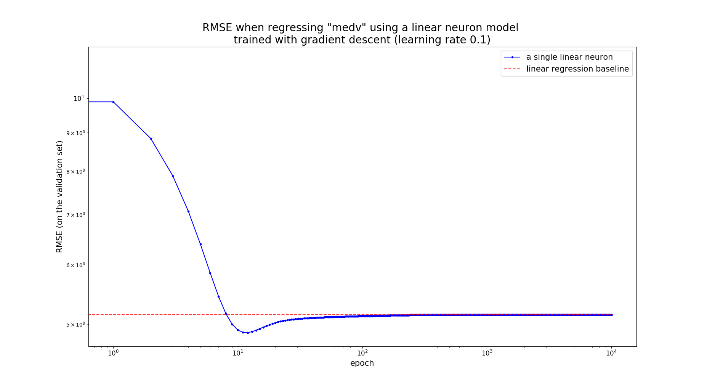

# Synopsis
`neuron-regress.py`: A python script for assessing the performance of a single linear artificial neuron model when used for a regression task and for comparing it with that of linear regression. 

# Syntax
```
neuron-regress.py [-h] --csv FILENAME [--target-name NAME]
                  [--validation-set-ratio RATIO] [--epochs EPOCHS]
                  [--lrate LRATE] [--no-norm] [--loglog]
```

# Description

The neuron model gets trained with batch gradient descent on the root mean square (RMSE) loss. The performance achieved with the scikit-learn implementation of linear regression is used for comparison. In particular, `neuron-regress.py` compuses the RMSE on a validation set at the end of every gradient descent iteration and it finally generates a plot with the progression of these measurements. If the training of the neuron goes fine, these measurements should converge towards the performance of linear regression on the same validation set. The latter is displayed as a dotted horizontal line on the same plot.

## Command line arguments

There is just one required argument (the --csv), the rest are optional. In particular:

* -h, --help
Show a detailed help message and exit.
* --csv FILENAME
**Required**. Relative path to the CSV file with the dataset
* --target-name NAME
The name of the variable to be regressed. If none is given then the last variable of the CSV is used as such.
* --validation-set-ratio RATIO
The fraction of the dataset to be used for validation (default: 0.1).
* --epochs EPOCHS
Number of epochs (iterations) to use for gradient descent (default: 200).
* --lrate LRATE
Learning rate to use for gradient descent (default: 0.1)
* --no-norm
By default, each of the features is linearly rescaled to so that its value in the training set has a zero mean and a standard deviation of one. This switch prevents this default behavior (default: False).
*  --loglog
Use a logarithmic scale for the two axes of the plot. This can be useful if you have specified many epochs (default: False).

# Examples

## Invocation with the default values 

As shown in [Command line arguments](command-line-arguments) by default `neuron-regress.py` performs 200 iterations of gradient descent with a learning rate of 0.1 using the 10% of the dataset for validation. The results look like this:
```console
user@system:~$ neuron-regress.py --csv dataset/mass_boston.csv

The loss with a single linear neuron is: 6.59579363684324
The parameteres of a single linear neuron are: 
[22.5668 -0.963   1.0831 -0.0691  0.7951 -1.7578  2.9326 -0.2769 -2.981
  2.5234 -1.9742 -1.9826  0.9789 -3.3682]

  The loss with linear regression baseline is: 6.594923271665585
  The parameteres of linear regression baseline are: 
  [22.5668 -0.9749  1.1018 -0.0097  0.7857 -1.7737  2.9219 -0.2669 -2.9818
    2.67   -2.1389 -1.9891  0.9801 -3.3747]
```

Notice how the values for the bias and the weights of the neuron are very close to those of the linear regression model. The generated plot is shown below:


## Increasing the number of epochs

Instead of 200 epochs, let' s specify 10000: 
```console
user@system:~$ neuron-regress.py --csv dataset/mass_boston.csv --epochs 10000 --loglog
The loss with a single linear neuron is: 5.148498158724566
The parameteres of a single linear neuron are: 
[22.7974 -1.0409  1.1265  0.0578  0.7052 -2.0971  2.5988  0.073  -3.1709
  2.9265 -2.1423 -2.1238  0.7868 -3.9471]

The loss with linear regression baseline is: 5.148498158724566
The parameteres of linear regression baseline are: 
[22.7974 -1.0409  1.1265  0.0578  0.7052 -2.0971  2.5988  0.073  -3.1709
  2.9265 -2.1423 -2.1238  0.7868 -3.9471]
````

Within the displayed accuracy, the parameters of the neuron are equal to those learnt with linear regression. We have also specified the `--loglog` flag, which makes it a bit easier to isolate different regions in the plots:


## Convergence
Gradient descent, at least as implemented here, is not guaranteed to converge. This can happen when the learning rate is too large for the dataset at hand.

By default, `neuron-regress.py` does not apply gradient descent  to the supplied dataset, but to a _linearly rescaled_ version of it. This operation attempts to bring all the features to the same scale, which can improve the convergence properties of gradient descent, especially if the some features are originally in very different scales.

For example, if we deactivate the rescaling operation for the "mass_boston.csv" dataset by passing the `--no-norm`, we have to use extremely low learning rates to achieve convergence, which also implies that the training process takes much more time to complete.

In fact, even with a learning rate as low as 10</sup>-5</sup> gradient descent does not converge, as shows on the results and the plot below:

```console
user@system:~$ neuron-regress.py --csv dataset/mass_boston.csv --epochs 10 --lrate 0.00001 --no-norm
The loss with a single linear neuron is: 48625.10860971238
The parameteres of a single linear neuron are: 
[  -1015.0908   -4616.5819   -9997.5768  -12165.4978     -63.4424
    -575.1853   -6321.3836  -72239.3525   -3651.7908  -11098.3452
 -445384.4468  -18967.6505 -362214.0019  -13608.8978]

The loss with linear regression baseline is: 6.074445952981716
The parameteres of linear regression baseline are: 
[ 39.255   -0.113    0.0562   0.0094   1.9957 -17.9045   3.4433  -0.0027
  -1.5715   0.309   -0.013   -0.927    0.0085  -0.5059]


```


